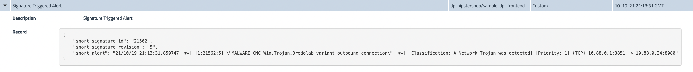
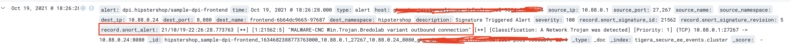

# Security: Deep packet inspection

**Goal:** Use DPI on select workloads to efficiently make use of cluster resources and minimize the impact of false positives.

---

>For each deep packet inspection resource (DeepPacketInspection), CalicoCloud creates a live network monitor that inspects the header and payload information of packets that match the [Snort community rules](https://www.snort.org/downloads/#rule-downloads). Whenever malicious activities are suspected, an alert is automatically added to the Alerts page in the Calico Manager UI.

## Steps

1. Configure deep packet inspection in your target workload, we will use `boutiqueshop/frontend` as example.

   ```bash
   kubectl apply -f demo/60-deep-packet-inspection/sample-dpi-frontend.yaml
   ```  

2. Configure resource requirements in IntrusionDetection.

    > For a data transfer rate of 1GB/sec on workload endpoints being monitored, we recommend a minimum of 1 CPU and 1GB RAM.

   ```bash
   kubectl apply -f demo/60-deep-packet-inspection/resource-dpi.yaml
   ```

3. Verify deep packet inspection is running and the daemonset of `tigera-dpi` is also running.

   ```bash
   kubectl get deeppacketinspections.crd.projectcalico.org 
   ```

   ```text
   NAME                  AGE
   sample-dpi-frontend   40s
   ```

   ```bash
   kubectl get pods -n tigera-dpi
   ```

   ```text  
   NAME               READY   STATUS    RESTARTS   AGE
   tigera-dpi-6mhz6   1/1     Running   0          2m2s
   tigera-dpi-kvqmp   1/1     Running   0          2m2s
   tigera-dpi-lj8sg   1/1     Running   0          2m2s
   ```

4. Trigger a snort alert basing on existing alert rules, we will use rule [57461](https://www.snort.org/rule_docs/1-57461)

   ```bash
   SVC_IP=$(kubectl get svc frontend-external -ojsonpath='{.status.loadBalancer.ingress[0].ip}')
   ```

   ```bash
   #curl your loadbalancer from outside of cluster
   curl http://$SVC_IP:80/secid_canceltoken.cgi -H 'X-CMD: Test' -H 'X-KEY: Test' -XPOST
   ```

5. Confirm the `Signature Triggered Alert` in manager UI and also in Kibana - Discover `tigera_secure_ee_events*` index.

    

    

**Congratulations! You have finished all the labs in the workshop.**

>Follow the cleanup instructions on the [main page](../README.md) if needed.
