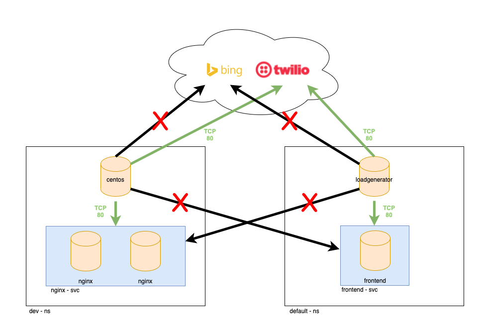
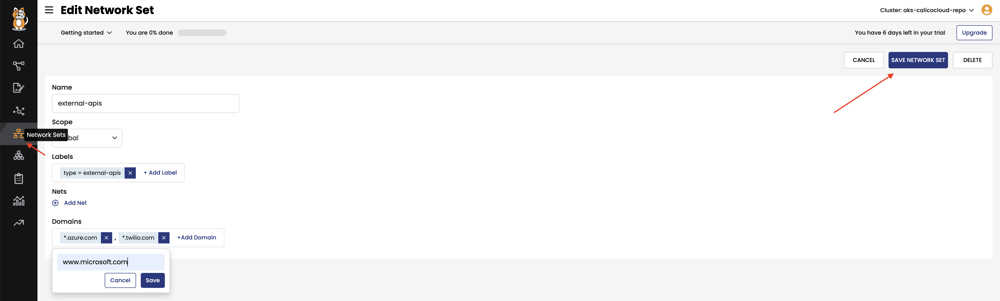

# Module 4: DNS egress access controls

**Goal:** Configure egress access for specific workloads.

## Steps

1. Implement DNS policy to allow the external endpoint access from a specific workload, e.g. `dev/centos`.

    a. Apply a policy to allow access to `api.twilio.com` endpoint using DNS rule.

    ```bash
    # deploy dns policy
    kubectl apply -f demo/20-egress-access-controls/dns-policy.yaml

    # test egress access to api.twilio.com
    kubectl -n dev exec -t centos -- sh -c 'curl -m3 -skI https://api.twilio.com 2>/dev/null | grep -i http'
    # test egress access to www.bing.com
    kubectl -n dev exec -t centos -- sh -c 'curl -m3 -skI https://www.bing.com 2>/dev/null | grep -i http'
    ```

    Access to the `api.twilio.com` endpoint should be allowed by the DNS policy but not to any other external endpoints like `www.bing.com` unless we modify the policy to include that domain name. The connectivity is represented in the diagram below
    <br>

    

    b. Edit the policy to use a `NetworkSet` instead of inline DNS rule.

    ```bash
    # deploy network set
    kubectl apply -f demo/20-egress-access-controls/netset.external-apis.yaml
    # deploy DNS policy using the network set
    kubectl apply -f demo/20-egress-access-controls/dns-policy.netset.yaml
    ```

    >the update version of `allow-twilio-access` policy is using `[destination: type == "external-apis"]` instead of `[source: app == 'centos']`, which will simplify your DNS egress management. Now we re-test access to twilio and bing to demonstrate policy using Network Sets is enforcing as expected:

    ```bash
    # test egress access to api.twilio.com
    kubectl -n dev exec -t centos -- sh -c 'curl -m3 -skI https://api.twilio.com 2>/dev/null | grep -i http'
    # test egress access to www.bing.com
    kubectl -n dev exec -t centos -- sh -c 'curl -m3 -skI https://www.bing.com 2>/dev/null | grep -i http'
    ```

    As access to Twilio is permitted and access to bing is denied we are able to whitelist domains as described next

    c. As a bonus example, you can modify the `external-apis` network set in calico cloud management UI to include `*.azure.com` domain name or `*.microsoft.com` which would allow access to azure/microsoft subdomains.

    ```bash
    # test egress access to www.azure.com and www.microsoft.com after you whitelist from UI.
    kubectl -n dev exec -t centos -- sh -c 'curl -m3 -skI https://www.microsoft.com 2>/dev/null | grep -i http'
    # test egress access to www.azure.com
    kubectl -n dev exec -t centos -- sh -c 'curl -m3 -skI https://www.azure.com 2>/dev/null | grep -i http'
    ```

    

[Next -> Module 5](../modules/layer7-logging.md)
