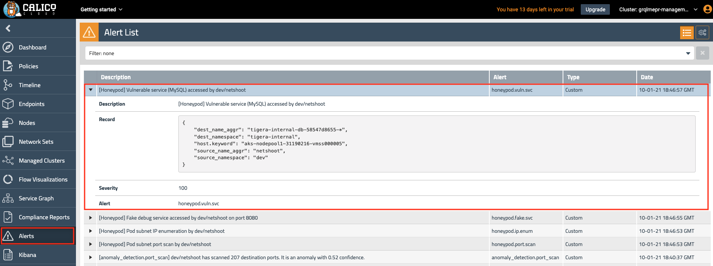

# Module 11: Honeypod Threat Detection

**Goal:** Deploy honeypod resources and generate alerts when suspicious traffic is detected

---

Calico offers [Honeypod](https://docs.calicocloud.io/threat/honeypod/) capability which is based upon the same principles as traditional honeypots. Calico is able to detect traffic which probes the Honeypod resources which can be an indicator of compromise. Refer to the [official honeypod configuration documentation](https://docs.calicocloud.io/threat/honeypod/honeypods) for more details.

## Steps

1. Configure honeypod namespace and Alerts for SSH detection

    ```bash
    # create dedicated namespace and RBAC for honeypods
    kubectl apply -f https://docs.calicocloud.io/manifests/threatdef/honeypod/common.yaml
    
    # add tigera pull secret to the namespace. We clone the existing secret from the calico-system NameSpace
    kubectl get secret tigera-pull-secret --namespace=calico-system -o yaml | \
    grep -v '^[[:space:]]*namespace:[[:space:]]*calico-system' | \
    kubectl apply --namespace=tigera-internal -f -
    ```

2. Deploy sample honeypods

    ```bash
    # expose pod IP to test IP enumeration use case
    kubectl apply -f https://docs.calicocloud.io/manifests/threatdef/honeypod/ip-enum.yaml

    # expose nginx service that can be reached via ClusterIP or DNS
    kubectl apply -f https://docs.calicocloud.io/manifests/threatdef/honeypod/expose-svc.yaml

    # expose MySQL service
    kubectl apply -f https://docs.calicocloud.io/manifests/threatdef/honeypod/vuln-svc.yaml
    ```

3. Verify newly deployed pods are running

    ```bash
    kubectl get pods -n tigera-internal
    ```

    Output should resemble:

    ```text
    NAME                                         READY   STATUS    RESTARTS   AGE
    tigera-internal-app-7jlg8                    1/1     Running   0          60s
    tigera-internal-app-lptd6                    1/1     Running   0          60s
    tigera-internal-app-rfllv                    1/1     Running   0          60s
    tigera-internal-dashboard-859fb4f577-6tgqj   1/1     Running   0          51s
    tigera-internal-db-58547d8655-hgjrc          1/1     Running   0          43s
    ```

4. Verify honeypod alerts are deployed

    ```bash
    kubectl get globalalerts | grep -i honeypod
    ```

    Output should resemble:

    ```text
    honeypod.fake.svc         2021-10-01T18:41:55Z
    honeypod.ip.enum          2021-10-01T18:41:53Z
    honeypod.network.ssh      2021-10-01T18:40:05Z
    honeypod.port.scan        2021-10-01T18:41:53Z
    honeypod.vuln.svc         2021-10-01T18:41:56Z
    ```

5. Test honeypod use cases

    Ping exposed Honeypod IP

    ```bash
    POD_IP=$(kubectl -n tigera-internal get po --selector app=tigera-internal-app -o jsonpath='{.items[0].status.podIP}')
    kubectl -n dev exec netshoot -- ping -c5 $POD_IP
    ```

    Output should resemble:

    ```bash
    kubectl -n dev exec netshoot -- ping -c5 $POD_IP

    PING 10.240.0.86 (10.240.0.86) 56(84) bytes of data.
    64 bytes from 10.240.0.86: icmp_seq=1 ttl=62 time=1.37 ms
    64 bytes from 10.240.0.86: icmp_seq=2 ttl=62 time=1.25 ms
    64 bytes from 10.240.0.86: icmp_seq=3 ttl=62 time=1.05 ms
    64 bytes from 10.240.0.86: icmp_seq=4 ttl=62 time=1.16 ms
    64 bytes from 10.240.0.86: icmp_seq=5 ttl=62 time=1.13 ms

    --- 10.240.0.86 ping statistics ---
    5 packets transmitted, 5 received, 0% packet loss, time 4004ms
    rtt min/avg/max/mdev = 1.053/1.191/1.366/0.107 ms
    ```

    `curl` Honeypod nginx service

    ```bash
    SVC_URL=$(kubectl -n tigera-internal get svc -l app=tigera-dashboard-internal-debug -ojsonpath='{.items[0].metadata.name}')
    SVC_PORT=$(kubectl -n tigera-internal get svc -l app=tigera-dashboard-internal-debug -ojsonpath='{.items[0].spec.ports[0].port}')
    kubectl -n dev exec netshoot -- curl -m3 -skI $SVC_URL.tigera-internal:$SVC_PORT | grep -i http
    ```

    Output should resemble:

    ```text
    HTTP/1.1 200 OK
    ```

    Query Honeypod MySQL service

    ```bash
    SVC_URL=$(kubectl -n tigera-internal get svc -l app=tigera-internal-backend -ojsonpath='{.items[0].metadata.name}')
    SVC_PORT=$(kubectl -n tigera-internal get svc -l app=tigera-internal-backend -ojsonpath='{.items[0].spec.ports[0].port}')
    kubectl -n dev exec netshoot -- nc -zv $SVC_URL.tigera-internal $SVC_PORT
    ```

    Output should resemble:

    ```text
    Connection to tigera-internal-backend.tigera-internal 3306 port [tcp/mysql] succeeded!
    ```

6. Head to `Alerts` view in the Enterprise Manager UI to view the related alerts. Note the alerts can take a few minutes to generate.

    

[Next -> Module 12](../modules/deep-packet-inspection.md)
