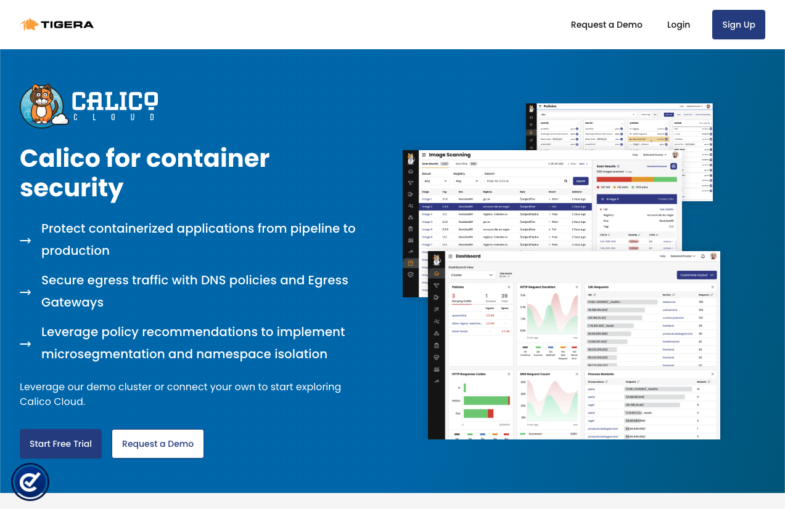
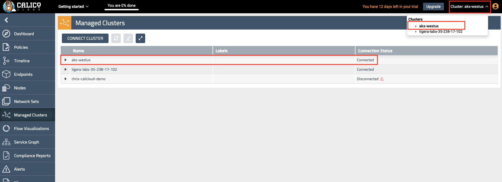

# Module 1: Joining AKS cluster to Calico Cloud

**Goal:** Join AKS cluster to Calico Cloud management plane.

IMPORTANT: In order to complete this module, you must have [Calico Cloud trial account](https://www.calicocloud.io/?utm_campaign=calicocloud&utm_medium=digital&utm_source=microsoft). Issues with being unable to navigate menus in the UI are often due to browsers blocking scripts - please ensure you disable any script blockers.

## Steps

1. Navigate to [calicocloud.io](https://www.calicocloud.io/?utm_campaign=calicocloud&utm_medium=digital&utm_source=microsoft) and sign up for a 14 day trial account - no credit cards required. Returning users can login.

   

2. Upon signing into the Calico Cloud UI the Welcome screen shows four use cases which will give a quick tour for learning more. This step can be skipped. Tip: the menu icons on the left can be expanded to display the worded menu as shown:

   

   

3. Join AKS cluster to Calico Cloud management plane.

    Click the "Managed Cluster" in your left side of browser.
    

    Click on "connect cluster"
    

    choose AKS and click next
    

    Run installation script in your aks cluster, script should look similar to this

    

    Output should look similar to:

    ```text
    namespace/calico-cloud created
    namespace/calico-system created
    namespace/tigera-access created
    namespace/tigera-image-assurance created
    namespace/tigera-license created
    namespace/tigera-operator created
    namespace/tigera-operator-cloud created
    namespace/tigera-prometheus created
    namespace/tigera-risk-system created
    customresourcedefinition.apiextensions.k8s.io/installers.operator.calicocloud.io created
    serviceaccount/calico-cloud-controller-manager created
    role.rbac.authorization.k8s.io/calico-cloud-installer-ns-role created
    role.rbac.authorization.k8s.io/calico-cloud-installer-calico-system-role created
    role.rbac.authorization.k8s.io/calico-cloud-installer-kube-system-role created
    role.rbac.authorization.k8s.io/calico-cloud-installer-tigera-image-assurance-role created
    role.rbac.authorization.k8s.io/calico-cloud-installer-tigera-prometheus-role created
    role.rbac.authorization.k8s.io/calico-cloud-installer-tigera-risk-system-role created
    clusterrole.rbac.authorization.k8s.io/calico-cloud-installer-role created
    clusterrole.rbac.authorization.k8s.io/calico-cloud-installer-sa-creator-role created
    clusterrole.rbac.authorization.k8s.io/calico-cloud-installer-tigera-operator-role created
    rolebinding.rbac.authorization.k8s.io/calico-cloud-installer-ns-rbac created
    rolebinding.rbac.authorization.k8s.io/calico-cloud-installer-calico-system-rbac created
    rolebinding.rbac.authorization.k8s.io/calico-cloud-installer-kube-system-rbac created
    rolebinding.rbac.authorization.k8s.io/calico-cloud-installer-tigera-access-rbac created
    rolebinding.rbac.authorization.k8s.io/calico-cloud-installer-tigera-image-assurance-rbac created
    rolebinding.rbac.authorization.k8s.io/calico-cloud-installer-tigera-license-rbac created
    rolebinding.rbac.authorization.k8s.io/calico-cloud-installer-tigera-operator-rbac created
    rolebinding.rbac.authorization.k8s.io/calico-cloud-installer-tigera-operator-rbac created
    rolebinding.rbac.authorization.k8s.io/calico-cloud-installer-tigera-prometheus-rbac created
    rolebinding.rbac.authorization.k8s.io/calico-cloud-installer-tigera-risk-system-rbac created
    clusterrolebinding.rbac.authorization.k8s.io/calico-cloud-installer-crb created
    deployment.apps/calico-cloud-controller-manager created
    % Total    % Received % Xferd  Average Speed   Time    Time     Time  Current
                                    Dload  Upload   Total   Spent    Left  Speed
    100   462  100   462    0     0   1263      0 --:--:-- --:--:-- --:--:--  1265
    secret/api-key created
    installer.operator.calicocloud.io/default created
    ```

    Joining the cluster to Calico Cloud can take a few minutes. Meanwhile the Calico resources can be monitored until they are all reporting `Available` as `True`

    ```bash
    kubectl get tigerastatus -w

    NAME                            AVAILABLE   PROGRESSING   DEGRADED   SINCE
    apiserver                       True        False         False      2m39s
    calico                          True        False         False      4s
    cloud-core                      True        False         False      2m6s
    compliance                      True        False         False      64s
    image-assurance                 True        False         False      52s
    intrusion-detection             True        False         False      54s
    log-collector                   True        False         False      39s
    management-cluster-connection   True        False         False      104s
    monitor                         True        False         False      3m14s
    policy-recommendation           True        False         False      109s
    ```

4. Navigating the Calico Cloud UI

    Once the cluster has successfully connected to Calico Cloud you can review the cluster status in the UI. Click on `Managed Clusters` from the left side menu and look for the `connected` status of your cluster. You will also see a `tigera-labs` cluster for demo purposes. Ensure you are in the correct cluster context by clicking the `Cluster` dropdown in the top right corner. This will list the connected clusters. Click on your cluster to switch context otherwise the current cluster context is in *bold* font.

    

5. Configure log aggregation and flush intervals for Calico cluster, we will use 10s instead of default value 300s for lab testing only.

    ```bash
    kubectl patch felixconfiguration.p default -p '{"spec":{"flowLogsFlushInterval":"10s"}}'
    kubectl patch felixconfiguration.p default -p '{"spec":{"dnsLogsFlushInterval":"10s"}}'
    kubectl patch felixconfiguration.p default -p '{"spec":{"flowLogsFileAggregationKindForAllowed":1}}'
    kubectl patch felixconfiguration.p default -p '{"spec":{"flowLogsFileAggregationKindForDenied":0}}'
    kubectl patch felixconfiguration.p default -p '{"spec":{"dnsLogsFileAggregationKind":0}}'
    ```

6. Configure Felix to collect TCP stats - this uses eBPF TC program and requires minimum Kernel version of v5.3.0. Further [documentation](https://docs.tigera.io/visibility/elastic/flow/tcpstats)

    ```bash
    kubectl patch felixconfiguration default -p '{"spec":{"flowLogsCollectTcpStats":true}}'
    ```

[Module 0 :arrow_left:](../modules/creating-aks-cluster.md) &nbsp;&nbsp;&nbsp;&nbsp;[:arrow_right: Module 2](../modules/configuring-demo-apps.md)

[:leftwards_arrow_with_hook: Back to Main](/README.md)
