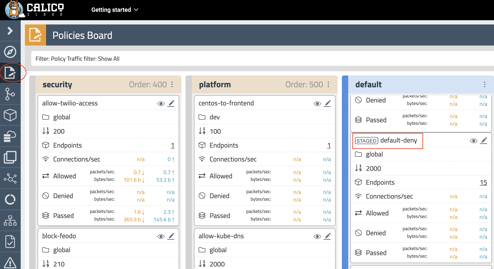
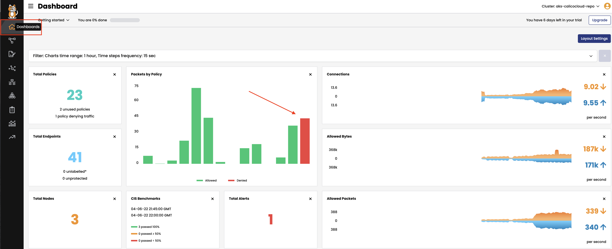
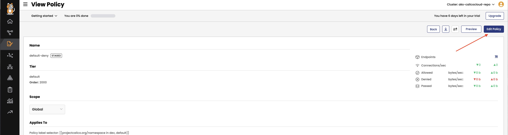
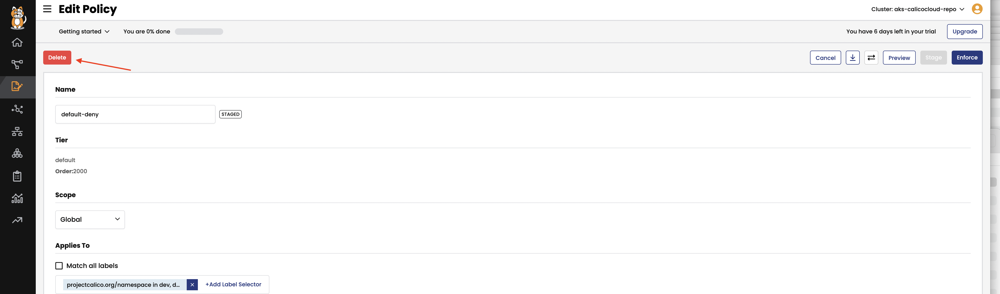

# Module 3: Pod access controls

**Goal:** Leverage network policies to segment connections within the AKS cluster and prevent known bad actors from accessing the workloads.

## Steps

1. Test connectivity between application components and across application stacks, since we don't have network policy in place, the pods are reachable from any endpoints.

    a. Test connectivity between workloads within each namespace.

    ```bash
    # test connectivity within dev namespace
    kubectl -n dev exec -t centos -- sh -c 'curl -m3 -sI http://nginx-svc 2>/dev/null | grep -i http'

    # test connectivity within default namespace
    kubectl exec -it $(kubectl get po -l app=loadgenerator -ojsonpath='{.items[0].metadata.name}') -c main -- sh -c 'curl -m3 -sI frontend 2>/dev/null | grep -i http'

    kubectl exec -it $(kubectl get po -l app=frontend -ojsonpath='{.items[0].metadata.name}') -c server -- sh -c 'nc -zv productcatalogservice 3550'
    ```

    b. Test connectivity across namespaces.

    ```bash
    # test connectivity from dev namespace to default namespace
    kubectl -n dev exec -t centos -- sh -c 'curl -m3 -sI http://frontend.default 2>/dev/null | grep -i http'

    # test connectivity from default namespace to dev namespace
    kubectl exec -it $(kubectl get po -l app=loadgenerator -ojsonpath='{.items[0].metadata.name}') -c main -- sh -c 'curl -m3 -sI http://nginx-svc.dev 2>/dev/null | grep -i http'
    ```

    c. Test connectivity from each namespace to the Internet.

    ```bash
    # test connectivity from dev namespace to the Internet
    kubectl -n dev exec -t centos -- sh -c 'curl -m3 -sI http://www.bing.com 2>/dev/null | grep -i http'

    # test connectivity from default namespace to the Internet
    kubectl exec -it $(kubectl get po -l app=loadgenerator -ojsonpath='{.items[0].metadata.name}') -c main -- sh -c 'curl -m3 -sI www.bing.com 2>/dev/null | grep -i http'
    ```

    All of these tests should succeed if there are no policies in place to govern the traffic for `dev` and `default` namespaces.

2. Apply staged `default-deny` policy.

    >Staged `default-deny` policy is a good way of catching any traffic that is not explicitly allowed by a policy without explicitly blocking it.

    ```bash
    kubectl apply -f demo/10-security-controls/staged.default-deny.yaml
    ```

    Review the network policy created by clicking `Policies` on the left menu. A staged default deny policy has been created in the `default` tier. You can view or edit the policy by double clicking the policy.

    

    You can view the potential affect of the staged `default-deny` policy if you navigate to the `Dashboard` view in your Calico Cloud Manager UI and look at the `Packets by Policy` histogram.

    

    To view more traffic in the `Packets by Policy` histogram we can generate traffic from the `centos` pod to the `frontend` service.

    ```bash
    # make a request across namespaces and view Packets by Policy histogram
    for i in {1..5}; do kubectl -n dev exec -t centos -- sh -c 'curl -m3 -sI http://frontend.default 2>/dev/null | grep -i http'; sleep 2; done
    ```

    >The staged policy does not affect the traffic directly but allows you to view the policy impact if it were to be enforced.

3. Apply network policies to control East-West traffic.

    ```bash
    # deploy dev policies
    kubectl apply -f demo/dev/policies.yaml

    # deploy boutiqueshop policies
    kubectl apply -f demo/boutiqueshop/policies.yaml
    ```

    Now as we have proper policies in place, we can enforce `default-deny` policy moving closer to zero-trust security approach. You can either enforced the already deployed staged `default-deny` policy using the `Policies Board` view in your Calico Cloud Manager UI, or you can apply an enforcing `default-deny` policy manifest.

    ```bash
    # apply enforcing default-deny policy manifest
    kubectl apply -f demo/10-security-controls/default-deny.yaml
    ```

    If the above yaml definition is deployed the policy `Staged default-deny` can be deleted through the Web UI. Within the policy board click the edit icon from the `Staged default deny` policy in the `default` tier. Then click `Delete`

    

    

4. Test connectivity with policies in place.

    a. The only connections between the components within each namespaces should be allowed as configured by the policies.

    ```bash
    # test connectivity within dev namespace
    kubectl -n dev exec -t centos -- sh -c 'curl -m3 -sI http://nginx-svc 2>/dev/null | grep -i http'

    # test connectivity within default namespace
    kubectl exec -it $(kubectl get po -l app=loadgenerator -ojsonpath='{.items[0].metadata.name}') -c main -- sh -c 'curl -m3 -sI frontend 2>/dev/null | grep -i http'
    ```

    b. The connections across `dev` and `default` namespaces should be blocked by the global `default-deny` policy.

    ```bash
    # test connectivity from dev namespace to default namespace
    kubectl -n dev exec -t centos -- sh -c 'curl -m3 -sI http://frontend.default 2>/dev/null | grep -i http'

    # test connectivity from default namespace to dev namespace
    kubectl exec -it $(kubectl get po -l app=loadgenerator -ojsonpath='{.items[0].metadata.name}') -c main -- sh -c 'curl -m3 -sI http://nginx-svc.dev 2>/dev/null | grep -i http'
    ```

    c. The connections to the Internet should be blocked by the configured `default-deny` policies.

    ```bash
    # test connectivity from dev namespace to the Internet
    kubectl -n dev exec -t centos -- sh -c 'curl -m3 -sI http://www.bing.com 2>/dev/null | grep -i http'

    # test connectivity from default namespace to the Internet
    kubectl exec -it $(kubectl get po -l app=loadgenerator -ojsonpath='{.items[0].metadata.name}') -c main -- sh -c 'curl -m3 -sI www.bing.com 2>/dev/null | grep -i http'
    ```

5. Implement egress policy to allow egress access from a workload in one namespace, e.g. `dev/centos`, to a service in another namespace, e.g. `default/frontend`. After the deployment, you can view the policy details under `platform` tier in `Policies Board`

    a. Deploy egress policy.

    ```bash
    kubectl apply -f demo/20-egress-access-controls/centos-to-frontend.yaml
    ```

    b. Test connectivity between `dev/centos` pod and `default/frontend` service.

    ```bash
    kubectl -n dev exec -t centos -- sh -c 'curl -m3 -sI http://frontend.default 2>/dev/null | grep -i http'
    ```

    The access should be allowed once the egress policy is in place.

[Next -> Module 4](../modules/dns-egress-access-controls.md)
